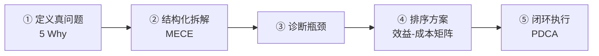
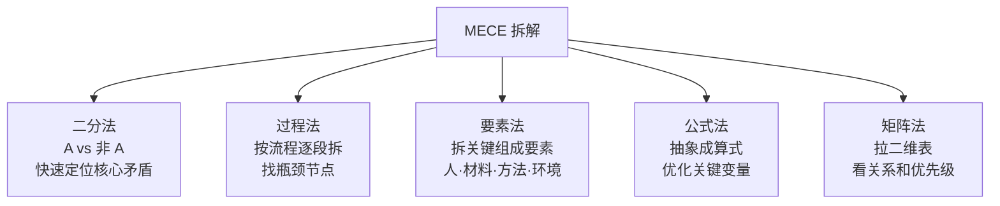
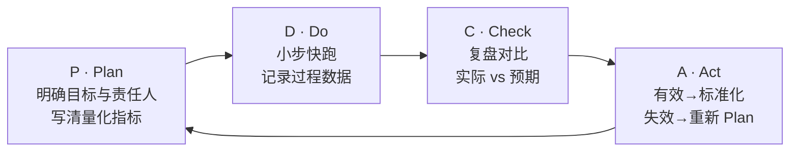

面对一个糊成一团的难题，我的本能反应曾经是——**直接想答案**。盯着它，皱着眉，等一个灵光乍现。结果往往是越想越乱，脑子里翻来覆去就那么几个老念头。

后来我慢慢发现，真正会解题的人，动作顺序跟我是反的。他们不急着要答案。他们先做一件很慢的事：**把问题往死里拆**。拆透了，才动手。

这篇文章，是我自己从摸索到用熟的一套5步解题框架。

## 第一步：5 Why + 第一性原理——锁定真问题

很多人一看到问题就急着找答案，结果往往是"治标不治本"，甚至走错方向。

**核心动作：连续追问5个"为什么"，层层剥离表面现象，逼近核心目的。** 本质上这就是[[第一性原理]]的实操版——别停在"问题表面"，一路往下退，退到一个不证自明、再也拆不动的"元起点"。

我拿自己举例。刚开始搭 Obsidian 知识库时，我沉迷各种花哨插件，装了卸、卸了装，折腾得不亦乐乎。直到我逼自己倒推了一句："一个**好**的知识库，到底靠什么成立？"答案很朴素——靠卡片的积累、概念之间的连接、以及最终产出输出。插件根本不在这条必要条件链上。想清楚这个，我立刻放下了插件焦虑。

练口语一直没起色，也是这么倒推出真正卡点的——不是词汇量，而是没有真实的输出场景。

更直接的例子，"我想学英语"：

- **Why 1**：为什么？→ 想通过社媒营销拿海外订单
- **Why 2**：为什么现在拿不到？→ 写出的文案生硬，无法吸引 C 端客户
- **锁定的真正问题**：如何提升面向 C 端转化率的文案口语表达——而不是盲目背四六级单词

**这一步最容易被跳过，却最贵。** 跳过它，后面四步可能全部白费。

## 第二步：[[MECE结构化拆解五法|MECE]] 五法——切开结构

明确了真正的目标后，开始把问题切碎。

**MECE（相互独立、完全穷尽）**是横向那把刀——切成既不重叠、又不遗漏的几块。具体有五种切法：

举个公式法的例子：

$$销售额 = 曝光量 \times 点击率 \times 转化率 \times 客单价$$

把这个公式一拆，每个变量单独审视，立刻知道优化哪个杠杆最大。你天天在用的"重要/紧急"四象限，本质就是矩阵法。

有一个吃过亏的局限要提：**MECE 是静态、树状的，而现实问题常常是要素互相影响的网状。** 所以拆完记得回头看看块和块之间有没有牵连，别拆死了。

## 第三步：诊断瓶颈——找那颗致命螺丝

通过第二步，你会得到一张清晰的"问题树"。接下来不是逐一解决所有子问题，而是找到那个**牵一发而动全身的根源**。

核心动作：对比数据或历史经验，找出哪一个子要素或哪一个流程节点是当下的**最大卡口**。

现实问题往往网状交织，同时优化10个节点不如打通1个关键瓶颈。找到那颗"致命螺丝"，才值得集中资源突破。

## 第四步：效益-成本矩阵——排序，不要乱打

针对诊断出的根源，通常会产出好几种解法。这时候需要理性排序。

我用的是**效益-成本矩阵**：

| 解决方案 | 预期效益（1-5） | 实施成本（1-5） | 性价比（效益 ÷ 成本） | 优先级 |
|---------|--------------|--------------|-------------------|--------|
| 方案 A（换工具） | 4 | 4 | 1.0 | 中 |
| 方案 B（优化现有流程） | 4 | 1 | **4.0** | **极高** |

原则：优先选**高收益、低成本**的"低垂果实"；警惕高成本、低收益的坑。别因为某个方案"看起来高级"就优先做它。

## 第五步：PDCA——让方案真正落地

方案排好序后，进入落地阶段。用 PDCA 滚动推进，目的是做到闭环——有执行、有复盘、有改进。

有一个细节很重要：**Plan 这一步，别只写"本周优化流程"，要写明"本周三前完成第一版修改，并设定5%转化率提升的量化目标"。** 没有量化的计划，Check 阶段就没法对比，整个循环就断了。

A（Act）这步同样关键：如果方案有效，把新流程写进知识库，变成下次的标准动作；如果失效，把教训沉淀下来，重新调整 Plan，进入下一个循环。

## 写在最后

把这套5步法用熟之后，我发现它给我的最大改变，其实不只是"解决了某个具体难题"，而是**换了一种面对"一团乱"的姿态**。

不再一上来就慌着要答案，而是先沉住气问"它的真正目的是什么"；拆透了结构，又允许自己稍微松开——去散个步，让思路从远处慢慢走过来，而不是死死盯着问题逼它出解法。**发散不是偷懒，是给答案留空间生长。**

工具箱里招式再多，核心其实就一句话：**先把问题拆清楚，找到那颗致命螺丝，再把方案跑起来，循环迭代。**
